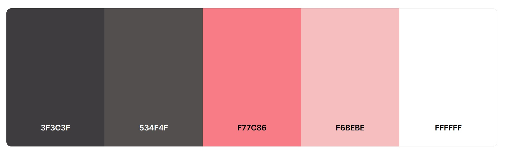
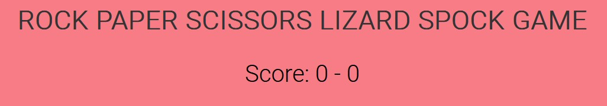
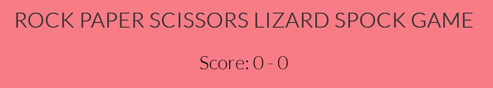

# Rock Paper Scissors Lizard Spock Game

### [Game Live](https://nil1143.github.io/p2rpsls/)

## Contents

* [Description](#description)
* [Project goals and UX](#project-goals-and-ux)
    * [Site owners Goals](#site-owners-goals)
    * [Requirements](#requirements)
    * [Expectations](#expectations)
    * [User Stories](#user-stories)
* [Design](#design)
    * [Colour Scheme](#colour-scheme)
    * [Fonts](#fonts)
    * [Wireframes](#wireframes)

 
- Description
- Project goals and UX
- Design
- Wireframes
- Features
- Testing
- Deployment
- Technology used

# **Description**

### Rock Paper Scissors Lizard Spock Game is an interactive game that tests your luck.   Player can choose one of the five options and the computer randomly select its choice.   The game determines the winner based on the rules:  
-Rock win vs Scissors & Lizard   -Paper win vs Rock & Spock   -Scissors win vs Paper & Lizard   -Lizard win vs Spock & Paper   -Spock win vs Rock and Scissors

### The primary goal is to entertain users with an interactive game that tests their luck and decision-making skills.

# **Project goals and UX**

## Site owners Goals

- Attract users with the logic game free and easy to play.
- An instruction with game rules.
- Restart the game anytime.

## Requirements

- Easy to navigate on various screen sizes and search engines.
- Clear and precise instruction about the game.
- Simple method to restart the game.
- Visually appealing design maintained.

 ## Expectations

- I expect screen size not to affect the quality any aspect of the website.
- I expect all game rules to be correct and accurate.
- I expect game is simple to play.
- I expect all choice/navigation buttons works correctly.

## User Stories

- As a user, I want to navigate the website using multiple devices.
- As a user, I want to find general information and rules about the game.
- As a user, I want to play the logical game against computer.
- As a user, I want to restart current game and start from beggining.

# **Design**

##  Colour Scheme 
Colour pallete was made on [Coolors](https://coolors.co/)

## Fonts
Fonts used on the website from [Google Fonts](https://fonts.google.com/)

Lato

Roboto

## Wireframes

### Desktop 

#### Main page

Click to see design

 

#### Instruction modal

Click to see design

 

#### Reset modal

Click to see design

 

### Mobile

Click to see design

 
