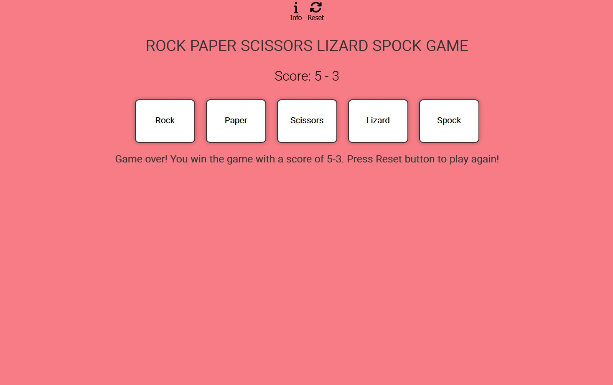
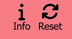
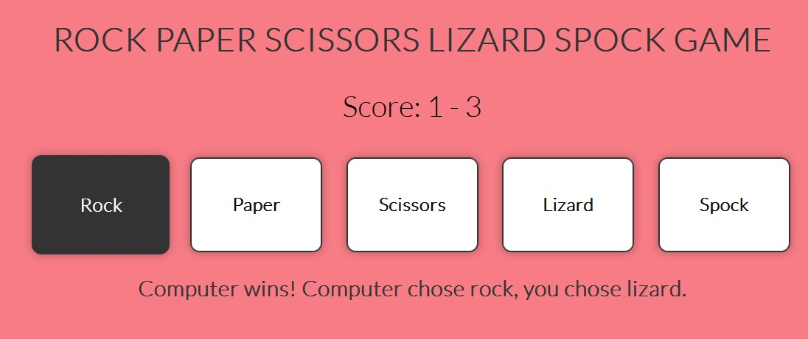
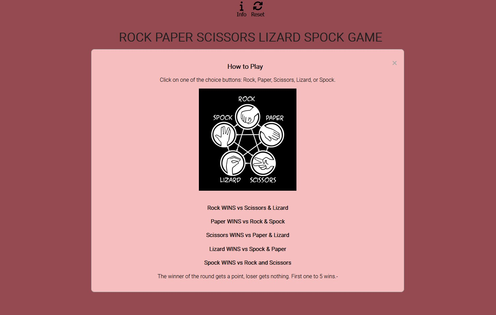
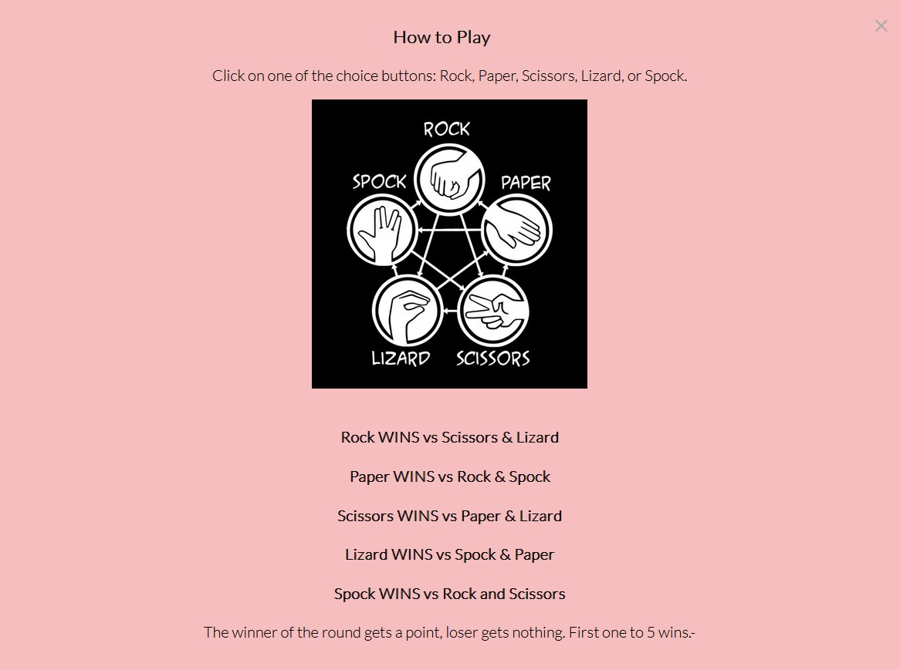
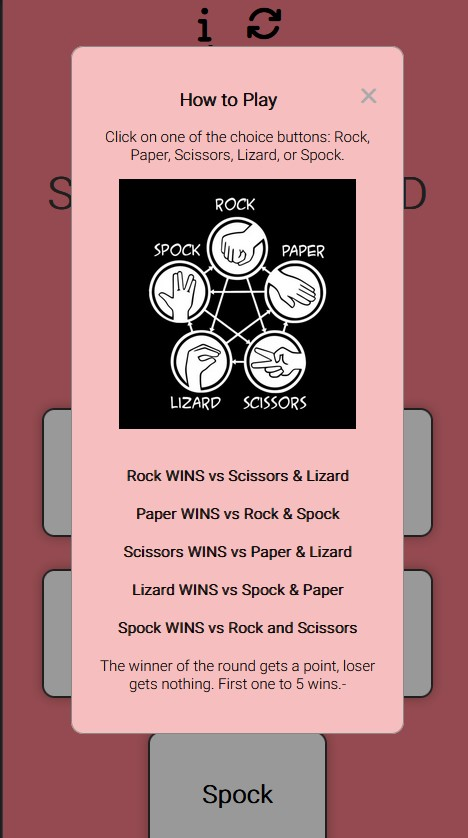
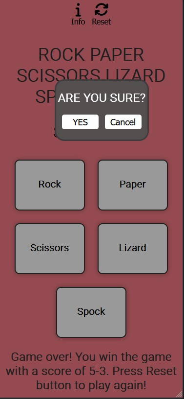
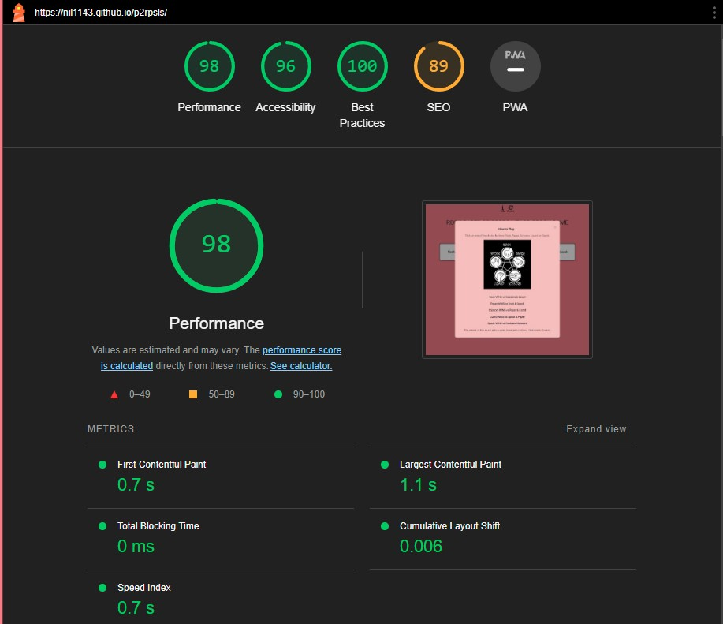
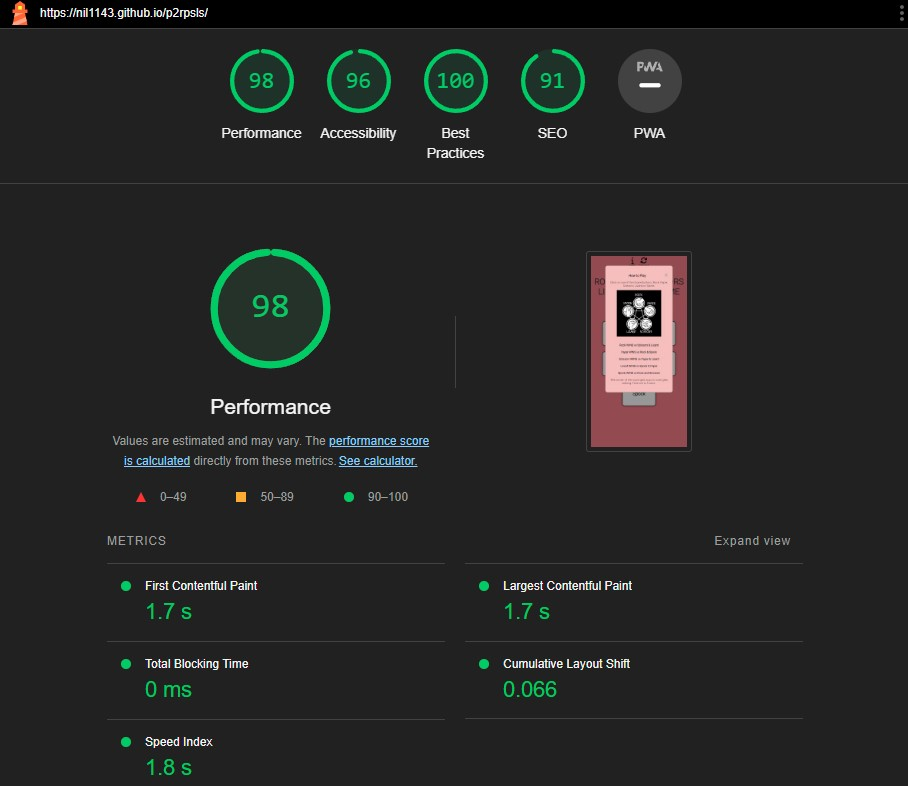

# Rock Paper Scissors Lizard Spock Game

### [Game Live](https://nil1143.github.io/p2rpsls/)

## Contents

* [Description](#description)
* [Project goals and UX](#project-goals-and-ux)
    * [Site owners Goals](#site-owners-goals)
    * [Requirements](#requirements)
    * [Expectations](#expectations)
    * [User Stories](#user-stories)
* [Design](#design)
    * [Colour Scheme](#colour-scheme)
    * [Fonts](#fonts)
    * [Wireframes](#wireframes)
* [Features](#features)
* [Testing](#testing)
    * [Validator Testing](#validator-testing)
    * [Accessibility testing](#accessibility-testing)
    * [User Stories](#user-stories)
    * [Fixed bugs](#fixed--bugs)
* [Deployment](#deployment)
    * [Cloning & Forking](#cloning--forking)
    * [Local Deployment](#local-deployment)
    * [Remote Deployment](#remote-deployment)
* [Fixed Bugs](#fixed-bugs)
* [Credits](#credits)
 
# **Description**

### Rock Paper Scissors Lizard Spock Game is an interactive game that tests your luck.   Player can choose one of the five options and the computer randomly select its choice.   The game determines the winner based on the rules:  
-Rock win vs Scissors & Lizard   -Paper win vs Rock & Spock   -Scissors win vs Paper & Lizard   -Lizard win vs Spock & Paper   -Spock win vs Rock and Scissors

### The primary goal is to entertain users with an interactive game that tests their luck and decision-making skills.

# **Project goals and UX**

## Site owners Goals

- Attract users with the logic game free and easy to play.
- An instruction with game rules.
- Restart the game anytime.

## Requirements

- Easy to navigate on various screen sizes and search engines.
- Clear and precise instruction about the game.
- Simple method to restart the game.
- Visually appealing design maintained.

 ## Expectations

- I expect screen size not to affect the quality any aspect of the website.
- I expect all game rules to be correct and accurate.
- I expect game is simple to play.
- I expect all choice/navigation buttons works correctly.

## User Stories

- As a user, I want to navigate the website using multiple devices.
- As a user, I want to find general information and rules about the game.
- As a user, I want to play the logical game against computer.
- As a user, I want to restart current game and start from beggining.

# **Design**

##  Colour Scheme 
Colour pallete was made on [Coolors](https://coolors.co/)

## Fonts
Fonts used on the website from [Google Fonts](https://fonts.google.com/)

Lato

Roboto

## Wireframes

### Desktop 

#### Main page

Click to see design

 

#### Instruction modal

Click to see design

 

#### Reset modal

Click to see design

 

### Mobile

Click to see design

 

# **Features**

### Desktop
 
Game Window

Instruction and Reset buttons trigger the modals

Game window with choice buttons, score and result message

Instruction modal appearing when entering the site and disappearing after 3 secs with setTimeout.
 

Instruction modal content

Reset modal content

### Mobile
 
Game window

Instruction

Reset

# **Testing**
### Validator Testing
#### HTML
* Index: No errors were returned when passing through the official W3C validator
 - https://validator.w3.org/nu/?doc=https%3A%2F%2Fnil1143.github.io%2Fp2rpsls%2F

#### CSS
* No errors were found when passing through the official Jigsaw validator
 - https://jigsaw.w3.org/css-validator/validator?uri=https%3A%2F%2Fnil1143.github.io%2Fp2rpsls%2F&profile=css3svg&usermedium=all&warning=1&vextwarning=&lang=en

#### JS
* No errors were found when passing through the official Jshint validator
    * There are 16 functions in this file.
    * Function with the largest signature take 2 arguments, while the median is 0.
    * Largest function has 11 statements in it, while the median is 2.
    * The most complex function has a cyclomatic complexity value of 17 while the median is 1.

### Accessibility Testing

To check the colors and fonts, I used Lighthouse in the Google devtools. The results are shown below:

Desktop

Mobile

### User Stories Testing

|Story No.|Result|Story|
| ------------- | ------------- | ------------- |
|1|As a user,   I want to navigate the website using multiple devices   I know I am done because game is responsible and playable on multiply devices as shown above.  |Test Pass|
|2|As a user,   I want to find general information and rules about the game   I know I am done when their are clear instructions shown to the user.  |Test Pass |
|3|As a user,   I want to play the logical, luck game against computer   I know I am done when the game functionality is well coded.  |Test Pass |
|4|As a user,   I want to restart current game and start from beggining   I know I am done when you can choose Reset button and make a decision to restart the game or not.   |Test Pass |

# **Deployment**

### Cloning & Forking

#### Fork
1. On GitHub.com, navigate to the [nil1143/p2rpsls](https://github.com/nil1143/p2rpsls) repository.
2. In the top-right corner of the page, click Fork.
3. By default, forks are named the same as their parent repositories. You can change the name of the fork to distinguish it further.
4. Add a description to your fork.
5. Click Create fork.

#### Clone
1. Above the list of files click the button that says 'Code'.
2. Copy the URL for the repository.
3. Open Terminal. Change the directory to the location where you want the cloned directory.
4. Type git clone, and then paste the URL
5. Press Enter.

### Local Deployment
1. Sign up to [Gitpod](https://gitpod.io/)
2. Download the Gitpod browser extension.
3. On GitHub.com, navigate to the [nil1143/p2rpsls](https://github.com/nil1143/p2rpsls) repository.
4. Above the list of files click the button that says 'Gitpod'.

### Remote Deployment
 The site was deployed to Github pages. If you have forked/cloned the repository the steps to deploy are:
 1. On GitHub.com, navigate to your repository.
 2. Navigate to the settings tab.
 3. Click on the tab called 'pages' on the left hand side.
 4. From the source drop down list under the heading Build and deployment, select main.
 5. The page will hten provide the link to the website.

# **Fixed Bugs**

There are no bugs with the final version.

# **Credits**

 ### Content
- Processes from the CI Love Running project was used to help create this website - [CI Love Running](https://code-institute-org.github.io/love-running-2.0/index.html)

- Processes from the Love Maths project was used to help create this website - [CI Love Maths](https://code-institute-org.github.io/love-maths/)

- HTML, CSS and Javascript code help was taken from w3schools - [W3Schools](https://www.w3schools.com/)

- There has been useful guidance from various articles from Stack Overflow - [Stack Overflow ](https://stackoverflow.com/)