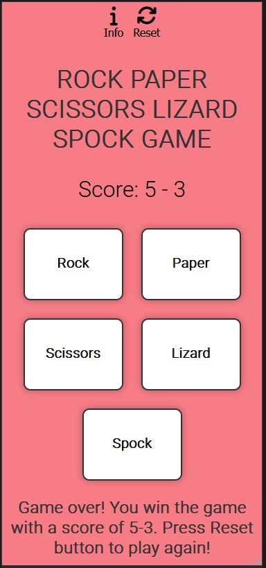

# Rock Paper Scissors Lizard Spock Game

### [Game Live](https://nil1143.github.io/p2rpsls/)

## Contents

* [Description](#description)
* [Project goals and UX](#project-goals-and-ux)
    * [Site owners Goals](#site-owners-goals)
    * [Requirements](#requirements)
    * [Expectations](#expectations)
    * [User Stories](#user-stories)
* [Design](#design)
    * [Colour Scheme](#colour-scheme)
    * [Fonts](#fonts)
    * [Wireframes](#wireframes)
* [Features](#features)
 
- Description
- Project goals and UX
- Design
- Wireframes
- Features
- Testing
- Deployment
- Technology used

# **Description**

### Rock Paper Scissors Lizard Spock Game is an interactive game that tests your luck.   Player can choose one of the five options and the computer randomly select its choice.   The game determines the winner based on the rules:  
-Rock win vs Scissors & Lizard   -Paper win vs Rock & Spock   -Scissors win vs Paper & Lizard   -Lizard win vs Spock & Paper   -Spock win vs Rock and Scissors

### The primary goal is to entertain users with an interactive game that tests their luck and decision-making skills.

# **Project goals and UX**

## Site owners Goals

- Attract users with the logic game free and easy to play.
- An instruction with game rules.
- Restart the game anytime.

## Requirements

- Easy to navigate on various screen sizes and search engines.
- Clear and precise instruction about the game.
- Simple method to restart the game.
- Visually appealing design maintained.

 ## Expectations

- I expect screen size not to affect the quality any aspect of the website.
- I expect all game rules to be correct and accurate.
- I expect game is simple to play.
- I expect all choice/navigation buttons works correctly.

## User Stories

- As a user, I want to navigate the website using multiple devices.
- As a user, I want to find general information and rules about the game.
- As a user, I want to play the logical game against computer.
- As a user, I want to restart current game and start from beggining.

# **Design**

##  Colour Scheme 
Colour pallete was made on [Coolors](https://coolors.co/)

## Fonts
Fonts used on the website from [Google Fonts](https://fonts.google.com/)

Lato

Roboto

## Wireframes

### Desktop 

#### Main page

Click to see design

 

#### Instruction modal

Click to see design

 

#### Reset modal

Click to see design

 

### Mobile

Click to see design

 

# **Features**

### Desktop
 
Game Window

Instruction and Reset buttons trigger the modals

Game window with choice buttons, score and result message

Instruction modal appearing when entering the site and disappearing after 3 secs with setTimeout.
 

Instruction modal content

Reset modal content

### Mobile
 
Game window

Instruction

Reset

# **Testing**
### Validator Testing
#### HTML
* Index: No errors were returned when passing through the official W3C validator
 - https://validator.w3.org/nu/?doc=https%3A%2F%2Fnil1143.github.io%2Fp2rpsls%2F

#### CSS
* No errors were found when passing through the official Jigsaw validator
 - https://jigsaw.w3.org/css-validator/validator?uri=https%3A%2F%2Fnil1143.github.io%2Fp2rpsls%2F&profile=css3svg&usermedium=all&warning=1&vextwarning=&lang=en

#### JS
* No errors were found when passing through the official Jshint validator
    * There are 16 functions in this file.
    * Function with the largest signature take 2 arguments, while the median is 0.
    * Largest function has 11 statements in it, while the median is 2.
    * The most complex function has a cyclomatic complexity value of 17 while the median is 1.

### Accessibility Testing

To check the colors and fonts, I used Lighthouse in the Google devtools. The results are shown below:

Desktop

Mobile

### User Stories Testing

#### First Time User
|Story No.|Result|Story|
| ------------- | ------------- | ------------- |
|1|As a user ,   I want to navigate the website using multiple devices.   so that I can enjoy the game    I know I am done when their are clear instructions shown to the user.   Evidence: The index page has clear signpost how to start the game and when a user first opens the game page the instruction modal appears telling the user how to play the game. |Test Pass|
|2|As a first time user,   I want to be able to add sound when playing the game   so that I can get more indicators that a bomb has been defused or exploded.   I know I am done when sounds plays when the user defuses a bomb and a sound plays wen a bomb explodes.   Evidence: In the settings modal, users are able to turn the sound on and control the volume level. |Test Pass |
|3|As a first time user,   I want to be able to change the colours   so that I can choose my lighting preference.    I know I am done when I can change the game colours.   Evidence: In the settings modal, users are able to turn the light mode on and off. |Test Pass |
|4|As a first time user,   I want to be able to change the colours   so that I can choose my lighting preference.    I know I am done when I can change the game colours.   Evidence: In the settings modal, users are able to turn the light mode on and off. |Test Pass |

- As a user, I want to navigate the website using multiple devices.
- As a user, I want to find general information and rules about the game.
- As a user, I want to play the logical game against computer.
- As a user, I want to restart current game and start from beggining.